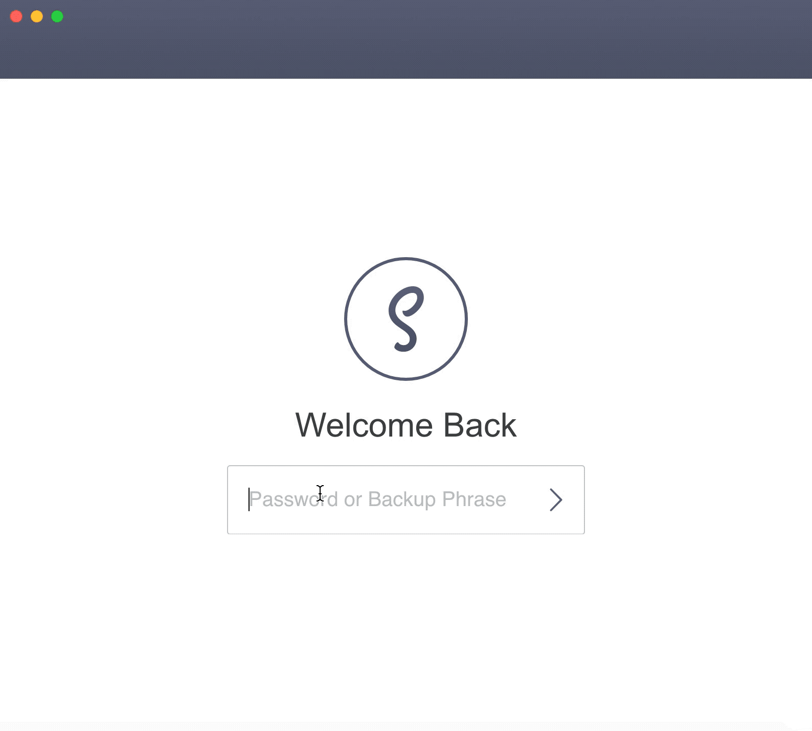

# Eos Sales Contract

**DISCLAIMER: This smart contract setup is not intended for production use, rather as an experimental setup 
to facilitate the understanding of EOS and the underlying principles. DO NOT USE this code in production or deploy it 
to the main network, as any EOS locked into the contract might be exposed to security risks. The code was not audited and 
should only be used for educational purposes.**

## Regular flow

## Contract Functionality
This example is intended to provide a sales contract between two parties which will be called seller and buyer from here on. Another actor is the intermediator which will be called upon resolution of a dispute. After running the instantiation script, the contract will be deployed. Next, all parties can interact with the contract. The buyer can set an item which he wants to sell to the buyer. After setting the item, the buyer can pay, and after he received the item, he can mark it as received. However, the seller can only withdraw the money after the buyer has marked the item as received. Now you may ask what happens if there is a dispute or the buyer vanishes. Then there is the possibility that the intermediator (some judge or juristic institution) and the seller can retract the contract, in which case the seller gets his money back. This scenario also works the other way around, if the buyer is ruled correct and the seller tried to scam him, then the buyer and the intermediator can retract the contract. In which case the buyer can withdraw the money. 
Of course, this setup introduces problems such as a 2-1 plot against either the buyer or the seller. Thus, this concept requires a trusted third party. Furthermore, edge cases such as the refund for a damaged item and so on are not covered by the contract. However, it is impossible to consider every exception which might occur in real life. That is why smart contracts should be backed by a legal binding contract. Nonetheless, this scenario demonstrates a very convenient use case of smart contracts. The implementation should be viewed as educational and not production ready.

## Local setup
Tested on MacOs Mojave (10.14.2) and Linux Mint 18.3 Sylvia
## Prerequisites:

### 1. Operating System
You need to use either Linux or MacOs to interact with the contract as the eosio software currently does not support the operating system Windows. It is possible to enable linux as a subsystem in Windows. 
However, the following guide is aimed at Linux and MacOs systems. 
If you are using Windows you can get started here (https://medium.com/@blockgenic/eosio-single-node-testnet-setup-on-windows-ae7a59900e69).

### 2. NPM
You need to have npm installed to work with this implementation.  
It is recommended to use a node version manager such as nvm  (https://github.com/creationix/nvm) to install npm

### 3. Keosd, cleos and nodeos
Please follow step 1.2 of the developer tutorial of EOS and install eosio, keosd, cleos and nodeos. Link: https://developers.eos.io/eosio-home/docs/setting-up-your-environment  
Versions:  
- cleos: client Build version: d4ffb4eb
- nodeos: v1.5.1
- keosd: v1.5.1  
Versions that differ from the aforementioned, can cause problems in the workflow. As there might be some breaking changes.  

**Do not create any other configurations such as the default wallet and test accounts from step 1.6 and 1.7 as they will be created automatically in the next step**

### 4. Clone this repository into a new folder/directory

### 5. Install all necessary dependencies through running the install script
From the root directory (eos_sales_contract) open a terminal and run: 
`npm install` 
The complete script should run without problems (no error messages), otherwise there will be problems later on! (yellow output is normal, as this just gives you the hint that the transactions are only executed locally)
(**Remark: This command will install all dependencies and it will run a setup script which makes other scripts executable, these necessary for the tests, furthermore it will create a default wallet. The password for the default wallet will be stored in scripts/pw.txt you only need it if you want to unlock it manually)** 
## Start the Tests
**Only after all previous steps (prerequisites 1-5 and npm install)**  
From the root directory (eos_sales_contract) run:  
`npm test`

## Start the Frontend

**Only after all previous steps (prerequisites 1-5 and npm install)**  
From the root directory (eos_sales_contract) run:  
`npm start`  
This will initialize a new eos chain (nodeos) and delete any previous data. 
The contract is now ready for interaction. But before, it is necessary to install scatter.

### Install Scatter  

To interact with the smart contract on the EOS Blockchain download the wallet provider Scatter (https://get-scatter.com/). Please follow the next steps:
- Start Scatter after downloading it
- Create a new wallet
- Import the private key for interaction (private key: 5K8ghcBf9TpPAWdxHDUejqcxBWrQAzkj5D5FWHe13nmNJmWhH9k)
- After importing the private key scatter should show you 5 accounts (seller, buyer, intermed, salescon, random)
- Go into the settings of Scatter and add a new network (this is under the section "danger zone")
  - Delete all currently existing networks
  - Afterwards add a new network (Hint: After deletion of the networks it might be necessary to leave the options and come back again, as there are some 
  refreshing problems)
  - Add the following configs for the network: 
    - Name: Testnet
    - Host: 127.0.0.1
    - Protocol: http
    - Port: 8888
    - chainId: cf057bbfb72640471fd910bcb67639c22df9f92470936cddc1ade0e2f2e7dc4f

Now open http://localhost:8082 and you can interact with the contract.

### Intended steps for interaction: 
Note: Every time you press a button while interacting with the contract, 
a pop up of Scatter will prompt you to allow this action. In the first interaction with the contract you need to choose the accounts for interaction. Make sure to select the correct account for the specific role in the contract. E.g. for Deploy choose salescon, for setItem choose seller, etc.  
- Deploy contract (for testing purposes choose the salescon account (from the scatter pop up) for deployment, this is the account where the contract will be deployed)  
**If you choose another deployment account you need to make sure that the account adds the code permission e.g. in cleos: 'cleos set account permission theAccountYouChoose active --add-code'**
- Set Item (seller account)
- Pay Item (buyer account)
- Received Item (buyer account)
- Withdraw (seller account)

Remark:  
**If you want to change the seller in this setup, you need to
remove the application from Scatter - more specifically the
connection with the name 'Sales Contract - Seller'. Otherwise
Scatter tries to sign future seller request with the old
seller account!**

